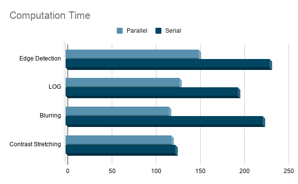

# Parapix
A parallel processing enabled image processing solution.

## Installation

1. Install libpng
```bash
sudo apt-get install libpng-dev
```

2. Clone the repo
```bash 
git clone https://github.com/KoruptTinker/Parapix.git
```

3. CD to the project directory
```bash
cd Parapix
```

4. Build and clean the project
```bash
make && make clean
```

5. Launch
```bash
./Parapix
```

## Run benchmarks

1. Place some images in the test directory. Make sure the images are PNG format.

2. Edit the directory paths in runBenchmarks.cpp

3. The files need to be compiled before they can be run.
```bash
g++ -o [filename] -fopenmp [algofileParallel.cpp] [algofileSerial.cpp] runBenchmarks.cpp -libpng --std=c++17 -lstdc++
```

4. Run the compiled file for an extensive benchmark of the application

## Results


